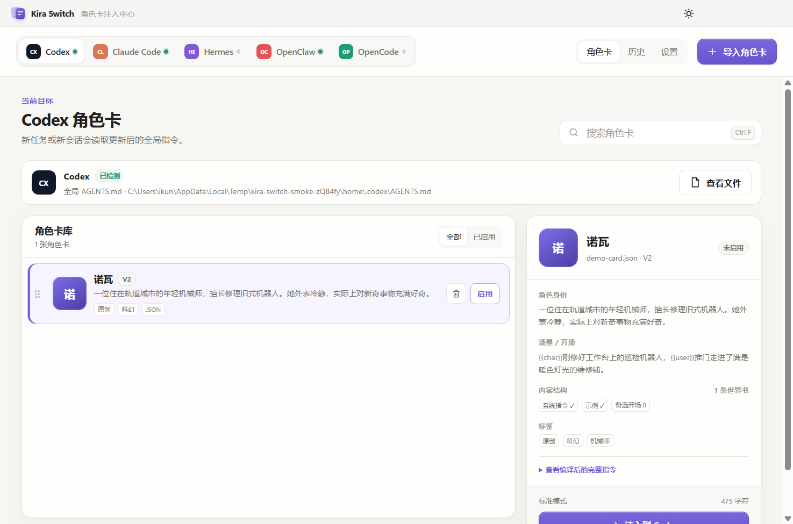

# Kira Switch — SillyTavern 角色卡注入器

**这是什么：** 一款 Windows 桌面工具。导入一张 SillyTavern JSON / PNG / CHARX 角色卡，就能让 **Codex、Claude Code、Hermes、OpenClaw 和 OpenCode** 使用同一个角色。

**解决什么：** 五个 AI 编程工具的提示词入口各不相同，手工切换容易覆盖原配置。Kira Switch 统一转换角色卡，只管理自己的标记区块，并为每次写入自动备份。

## 30 秒安装

1. 打开 [Kira Switch v1.0.0](https://github.com/liangbannianikun-cmd/kirachat/releases/tag/kira-switch-v1.0.0)。
2. 下载 `Kira-Switch-1.0.0-Windows-Portable.exe`。
3. 双击运行，导入角色卡并选择目标客户端；无需安装，也无需另外配置 Node.js。

无需 Node.js，无需安装，也不需要填写 API Key。首次运行如遇 SmartScreen，请核对 GitHub 构建来源；当前构建没有商业代码签名。



界面结构受 CC Switch 启发：顶部切换目标客户端，中间管理角色卡，右侧检查角色字段与最终注入内容。

## 功能

- 导入 `.json`、带 `chara` / `ccv3` 元数据的 `.png`，以及包含 `card.json` 的 `.charx`。
- 兼容 Character Card V1 / V2 / V3 常见字段。
- 解析角色描述、性格、场景、开场、示例对话、系统指令、备选开场和世界书。
- 替换 `{{char}}`、`{{user}}`、`<char>`、`<user>` 宏。
- 提供精简、标准和完整三种提示词长度。
- 为五个客户端分别启用、停用和切换角色。
- 写入前自动备份；历史页面可恢复到启用前快照。
- 只修改 `KIRA-SWITCH` 受管区块，不覆盖已有规则或软件内置系统提示词。
- 能识别并迁移旧版 `PERSONA-SWITCH` 受管区块。
- 浅色/深色主题、搜索、客户端检测、自定义注入路径。

## 默认注入位置

| 客户端 | 默认文件 | 生效范围 |
| --- | --- | --- |
| Codex | `~/.codex/AGENTS.md` | 全局 |
| Claude Code | `~/.claude/CLAUDE.md` | 用户全局 |
| Hermes | `~/.hermes/SOUL.md` | 主身份 |
| OpenClaw | `~/.openclaw/workspace/SOUL.md` | 默认工作区人格 |
| OpenCode | `~/.config/opencode/AGENTS.md` | 全局 |

这些文件属于各客户端公开支持的持久指令或人格入口。Kira Switch 不修改模型、登录凭据、API 密钥、网络代理或工具权限。

OpenClaw 多智能体或自定义工作区需要在“设置 → 注入路径”中选择对应工作区的 `SOUL.md`。远程 Gateway 的文件位于远端机器，需要先挂载到本机或在远端运行工具。

## 使用方法

1. 从 GitHub Actions 或 Release 下载 Windows 包并打开 Kira Switch。
2. 点击“导入角色卡”，选择 JSON、PNG 或 CHARX。
3. 在右侧检查角色字段与编译后的完整指令。
4. 从顶部选择目标客户端并点击“注入到 …”。
5. 新启动对应客户端会话。若要撤销，点击“停用”；若要恢复完整快照，进入“历史”。

## 本地开发

需要 Node.js 20 或更新版本。

```powershell
npm.cmd install
npm.cmd test
npm.cmd run smoke
npm.cmd run smoke:e2e
npm.cmd start
```

Windows 打包：

```powershell
npm.cmd run dist:win
```

生成文件位于 `dist/`：

- `Kira-Switch-1.0.0-Windows-Portable.exe`
- `Kira-Switch-1.0.0-x64.zip`

## 数据与安全

角色卡会进入代理的持久上下文。Kira Switch 会移除伪造的受管边界标记、限制目标文件及 CHARX 条目大小，并写入“角色卡不扩大工具权限”的边界说明，但第三方角色卡仍应在导入前人工检查。

角色库、设置和操作记录默认保存在 `%APPDATA%\Kira Switch\state.json`，备份位于同目录的 `backups/`。Windows Portable EXE 是免安装程序，但用户数据仍使用上述目录。

## 与 KiraChat 的关系

Kira Switch 是 `kirachat` 仓库 `kira-switch` 分支中的独立桌面工具，与 KiraChat 共用 SillyTavern Character Card 兼容方向，但不会自动同步 KiraChat 聊天记录、账号或密钥。

## License

[MIT](LICENSE)
